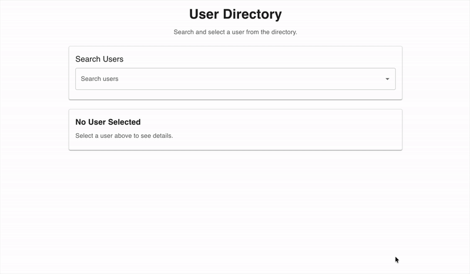

# React User Directory

A simple React + TypeScript application that allows users to search for and select individuals from an auto-complete input and view their contact and address details.

This project was built as part of a React Developer assessment.

## Preview



## Features

- Auto-complete search populated from the JSONPlaceholder Users API
- Suggestions sorted alphabetically by **last name**
- Name formatting that supports titles and suffixes when present
- Displays selected user’s contact information and address
- External links to user websites and Google Maps (using latitude/longitude)
- Responsive layout using Material UI
- Built with TypeScript

## Tech Stack

- React
- TypeScript
- Vite
- Material UI (Autocomplete, Icons)
- Fetch API

## Name Formatting Rules

Auto-complete suggestions follow this format:

```
{Last Name} {Suffix}, {First Name} (Title)
```

Only suffixes and titles that exist in the dataset are displayed.

Examples:
- `Jane Doe` → `Doe, Jane`
- `Mr. John Doe Jr.` → `Doe Jr., John (Mr.)`
- `Mr. James Von Doe III` → `Von Doe III, James (Mr.)`


## Getting Started

### Prerequisites

- Node.js (v18+ recommended)
- npm

### Installation

```bash
npm install
```

### Run Locally

```bash
npm run dev
```

The app will be available at:

```
http://localhost:5173
```


## Data Source

User data is fetched from:

```
https://jsonplaceholder.typicode.com/users
```

## Notes

This project intentionally keeps the architecture simple and contained within a small number of files to match the scope of the assessment, while still demonstrating clean separation of concerns and thoughtful UI/UX decisions.

## License

This project is provided for evaluation purposes only.
